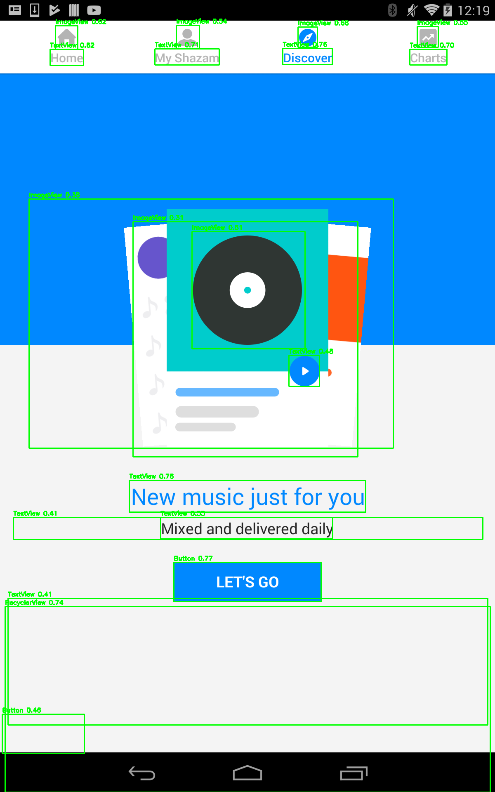

# ui2compose

**Automatic generation of Jetpack Compose UI code from Android screen designs.**

`ui2compose` takes a screenshot (or design mockup) of an Android screen and produces
runnable [Jetpack Compose](https://developer.android.com/compose) code. It combines a
YOLO-based UI component detector with a rule-based layout-inference and code-generation
stage:

```
Screenshot ──► 1. Component detection (YOLO) ──► 2. UI graph construction ──► 3. Compose code generation
```

1. **Component detection** — a YOLOv8s model (trained on the [ReDraw](https://zenodo.org/records/2530277) dataset,
   13 Android UI component classes) locates components such as `Button`, `EditText`, `ImageView` on the input image.
2. **UI graph construction** — detections are organized into a hierarchy (rows, columns, containment)
   based on their spatial relations.
3. **Code generation** — the UI graph is translated into idiomatic Jetpack Compose code
   (`Column`, `Row`, `Button`, `TextField`, …) via deterministic mapping rules.

Pretrained weights are included in the repository (`runs/oversample_5k/weights/best.pt`, 21 MB),
so inference works out of the box — no training required.

## Installation

Requires Python ≥ 3.10.

```bash
git clone https://github.com/gbilgeturk/ui2compose.git
cd ui2compose
python -m venv .venv && source .venv/bin/activate   # Windows: .venv\Scripts\activate
pip install -r requirements.txt
```

## Quick start

Run the end-to-end pipeline on a bundled example screenshot:

```bash
python src/run/run_pipeline.py
```

This reads the settings in `configs/pipeline_config.yaml` (input image, model,
thresholds) and writes to `output/`:

- `4_GeneratedScreen.kt` — the generated Jetpack Compose code
- `1_detections.json` / `1_detections_viz.png` — detected components (+ annotated image)
- `3_ui_graph.json` — the intermediate UI hierarchy

To run on your own screenshot:

```bash
python src/infer/pipeline_end_to_end.py path/to/screenshot.png \
    --model runs/oversample_5k/weights/best.pt \
    --dataset-yaml configs/dataset.yaml \
    --output output
```

### Example output

Detection stage on one of the bundled example screens (class label + confidence per component):



The screenshots in `examples/` are taken from the test split of the
[ReDraw dataset](https://zenodo.org/records/2530277) (Moran et al., *IEEE TSE* 2020;
DOI: [10.5281/zenodo.2530277](https://doi.org/10.5281/zenodo.2530277), CC BY 4.0) and are
included solely as illustrative inputs for research purposes; all app screens remain
the property of their respective owners.

## Interactive demo (Streamlit)

```bash
streamlit run app/demo.py
```

Upload a screenshot (or pick one of the bundled examples), inspect the detections and
the UI graph, and copy the generated Compose code.

## Preparing the dataset (optional — for training/evaluation)

The detector was trained on the [ReDraw dataset](https://zenodo.org/records/2530277)
(Moran et al., *IEEE TSE* 2020). The dataset itself is **not redistributed** in this
repository (only the ten illustrative screenshots under `examples/`); download it
from its authors, then:

```bash
# 1. Convert ReDraw hierarchies + screenshots to YOLO bounding-box labels
python src/preprocess/parse_redraw.py \
    --raw-root data/raw --out-root data/interim/labels \
    --dataset-yaml configs/dataset.yaml

# 2. Build the train/val/test split (80/10/10)
python src/preprocess/build_dataset.py \
    --labels-root data/interim/labels --images-root data/raw \
    --yolo-root data/yolo --clean --write-yaml --dataset-yaml configs/dataset.yaml

# 3. (Optional) Oversample under-represented classes
python src/preprocess/oversample_dataset.py

# 4. Evaluate a model on the test split
python src/evaluation/calculate_metrics.py \
    --model runs/oversample_5k/weights/best.pt
```

## Reproducing the experiments

The repository ships only the final model (`runs/oversample_5k/weights/best.pt`). The
weights of **all eight experiments** reported in the accompanying thesis — the
YOLOv8s/YOLOv11s model comparison, the input-resolution ablation (320–640 px), and the
oversampling ablation (2k/5k) — are published as assets of the
[v1.0.0 GitHub release](https://github.com/gbilgeturk/ui2compose/releases/tag/v1.0.0).

To evaluate any of them, download the weight file and place it in the layout the tools
expect, e.g.:

```bash
mkdir -p runs/yolov11s/weights
mv ~/Downloads/model_comparison_yolov11s.pt runs/yolov11s/weights/best.pt
python src/evaluation/calculate_metrics.py --model runs/yolov11s/weights/best.pt
```

The Streamlit demo automatically lists every model found under `runs/*/weights/best.pt`,
so downloaded weights become selectable in the UI without further configuration.

The numerical results of all experiments (overall and per-class metrics as reported in
the thesis) are included in [`results/`](results/) as JSON files, so the reported
numbers can be inspected without downloading any weights.

## Repository layout

| Path | Purpose |
|---|---|
| `src/preprocess/` | ReDraw → YOLO dataset conversion, split, oversampling |
| `src/infer/` | Detection, UI-graph construction, Compose code generation |
| `src/evaluation/` | mAP / per-class AP metrics, qualitative visualizations |
| `src/run/run_pipeline.py` | Config-driven end-to-end runner |
| `app/demo.py` | Streamlit demo UI |
| `configs/` | Dataset and pipeline configuration |
| `runs/oversample_5k/weights/best.pt` | Released detector weights (YOLOv8s) |
| `examples/` | Sample input screenshots |

## Model

The released model is a YOLOv8s detector fine-tuned on ReDraw with class-balanced
oversampling (minority classes oversampled to 5k instances), which gave the best
overall results in our experiments (mAP@50 ≈ 51.8% on the held-out test split across
13 classes). Training and ablation notebooks (model size, input resolution,
oversampling level) are part of the accompanying thesis work.

## Citation

If you use this software in your research, please cite:

```bibtex
@mastersthesis{bilgeturk2026ui2compose,
  author = {Bilget{\"u}rk, G{\"o}kt{\"u}rk},
  title  = {Automatic Generation of Declarative UI Components from Design Mockups
            Using Machine Learning Techniques},
  school = {{\c{C}}ankaya University},
  year   = {2026},
}
```

## License

[MIT](LICENSE)
